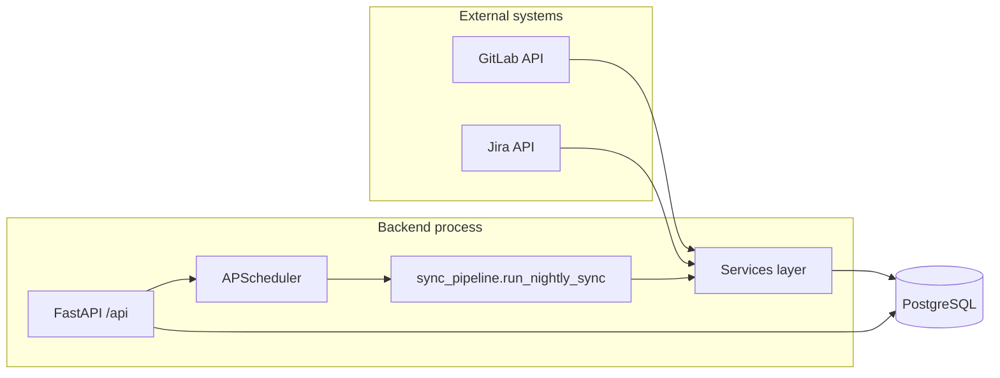
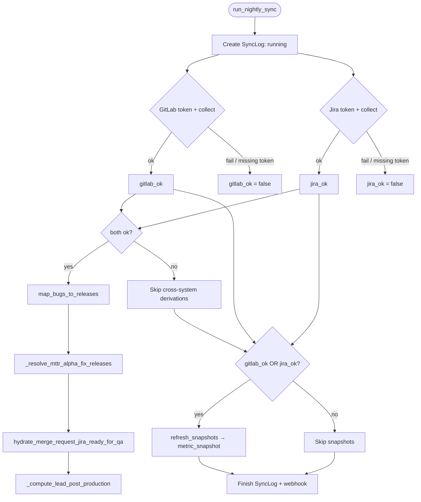
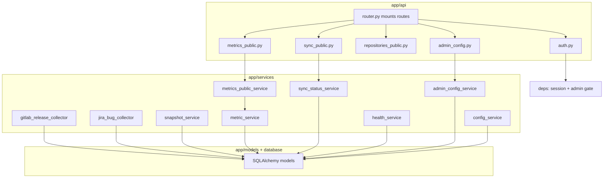
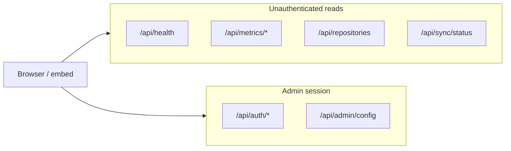
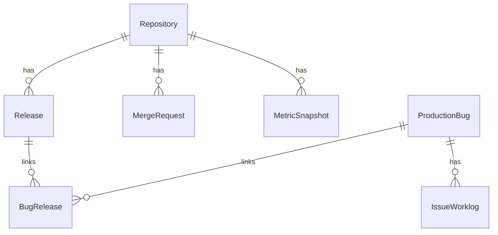

# DORA Metrics — Codebase overview

This document describes **what the repository implements today** (as opposed to the full product spec in `project_definition_2/`). It is meant to orient contributors who feel the codebase has grown large: most pieces exist to support **one daily pipeline**, **pre-aggregated metrics**, and **clear freshness/RBAC boundaries**.

---

## What the system does (one paragraph)

The **Python backend** pulls delivery data from **GitLab** (repos, customer-release tags, merged MRs, commit enrichment) and **Jira** (production bugs, versions, worklogs, changelog-derived timestamps). It stores everything in **PostgreSQL**, runs **derivation steps** (bug↔release links, MTTR Alpha fix release, lead post-production, MR “ready for QA” hydration), then **recomputes `metric_snapshot` rows** per active repository and configured period windows. **FastAPI** exposes **unauthenticated** read APIs for metrics, repositories, sync status, and health, plus **session-protected** admin login and configuration. **APScheduler** triggers the same pipeline on a **UTC cron** (default aligned with nightly refresh). The **Next.js** app is a **minimal baseline** (placeholder home page); dashboard work is expected to consume the public API later.

**Diagram exports:** matching **`.mmd`** and **`.svg`** files live under `docs/diagrams/`. Regenerate SVGs with `pwsh docs/diagrams/render.ps1` (uses `npx @mermaid-js/mermaid-cli`).

---

## Repository layout

| Area | Role |
| --- | --- |
| `backend/app/` | FastAPI app, services, models, API routers, scheduler |
| `backend/alembic/` | Database migrations |
| `backend/tests/` | Unit and integration tests (`pytest`) |
| `frontend/` | Next.js 14 App Router (scaffold) |
| `POC/` | Earlier GitLab/Jira exploration scripts (not the production path) |
| `project_definition_2/` | Canonical **spec** and domain documentation |

---

## Runtime architecture

- **Single process** runs HTTP and the scheduler; the nightly job calls the same pipeline logic tests can invoke.
- **Secrets** (GitLab/Jira tokens, session secret, admin password) come from environment variables; **tunable settings** also merge from `app_configuration` via `config_service`.

---

## Nightly sync pipeline (actual order in code)

The orchestrator is `run_nightly_sync` in `backend/app/services/sync_pipeline.py`. Behaviour highlights:

- **Independent collectors**: GitLab and Jira each run in a try/except; one can fail while the other succeeds.
- **Cross-system steps** (`map_bugs_to_releases`, MTTR Alpha resolution, Jira RFQ hydration, lead post-production) run only when **both** collectors succeeded.
- **Snapshots** run when **at least one** collector succeeded (even if derivations partially failed—warnings are logged).
- **`SyncLog`** rows track runs; stale `running` rows older than four hours are marked `crashed`.
- Optional **webhook** POST on completion (from config), now using structured event payloads (`SYNC_SUCCESS`, `SYNC_PARTIAL_FAILURE`, `SYNC_COMPLETE_FAILURE`).

---

## Backend layers (where logic lives)

- **Routes stay thin**: validation and HTTP concerns only; aggregation and rules sit in services.
- **`metric_service`** implements period math and KPI formulas over ORM data; **`snapshot_service`** loops repositories × period windows and upserts **`MetricSnapshot`**.
- **`metrics_public_service`** shapes API DTOs (trends, display strings, performance levels) from snapshots.

---

## HTTP API surface (`/api`)

| Prefix | Auth | Purpose |
| --- | --- | --- |
| `GET /api/health` | Public | DB + GitLab + Jira reachability-style health |
| `GET /api/metrics/current`, `/history`, `/repository/{id}` | Public | Current and historical metrics from snapshots |
| `GET /api/repositories` | Public | Active repositories list |
| `GET /api/sync/status` | Public | Freshness / last sync derived from `SyncLog` + config |
| `POST /api/auth/login`, `logout`, `GET /api/auth/me` | Login + session | Admin session cookie (`dora_session`) |
| `GET|PATCH /api/admin/config` | Admin session | Read/patch `app_configuration` (masked secrets in responses) |
| `POST /api/admin/config/webhook/test` | Admin session | Send a `SYNC_TEST` webhook to draft URL (or saved fallback) and return delivery result + payload |

Legacy **`GET /health`** returns a simple `{"status":"ok"}` for basic probes.

---

## Data model (tables the code actively uses)

Core entities:

- **`repository`** — GitLab projects tracked for metrics.
- **`release`** — Tags / release metadata from GitLab (customer vs pre-release driven by config).
- **`merge_request`** — Merged MRs with enrichment (`first_commit_at`, customer tag resolution, Jira key, lead post-production hours, etc.).
- **`production_bug`** — Jira bugs with health, versions, MTTR Alpha fields, ready-for-QA timestamps where applicable.
- **`bug_release`** — Many-to-many links bugs ↔ releases after `map_bugs_to_releases`.
- **`issue_worklog`** — Jira worklogs for extended KPIs / comparisons.
- **`metric_snapshot`** — Pre-aggregated metrics per repository, period type, and window (what the public metrics API prefers to read).
- **`sync_log`** — Audit trail for sync runs (including structured `details_json`).
- **`app_configuration`** — JSON settings merged with env for runtime behaviour (see `config_schema`).

(Not every FK is drawn; this matches the **conceptual** relationships the services enforce.)

---

## Frontend (`frontend/`)

- **Next.js App Router** with a placeholder **`app/page.tsx`** (“baseline initialized”).
- No TanStack Query / charts wired to the API yet in this tree; treat the backend as the **mature** side for now.

---

## Tests and quality gates

- **`backend/tests/unit/`** — Collectors, pipeline helpers, metric/snapshot edges, auth, admin config, scheduler, public services, etc.
- **`backend/tests/integration/`** — Migrations, auth/admin API boundaries, DB-backed flows.
- Run backend checks from `backend/` with **`pytest`**, **`ruff`**, **`mypy`** per project conventions.

---

## How this doc relates to `project_definition_2/`

- **`project_definition_2/`** defines **product intent**, KPI semantics, and long-term UI/ops expectations.
- **This file** describes the **current code paths** so you can see why modules exist: they mostly support **sync → derive → snapshot → read API**, with **admin config** and **health/sync visibility** layered on top.

When behaviour changes, update **tests** and, if the change is user-facing or contractual, the **spec docs** in `project_definition_2/` as well.
