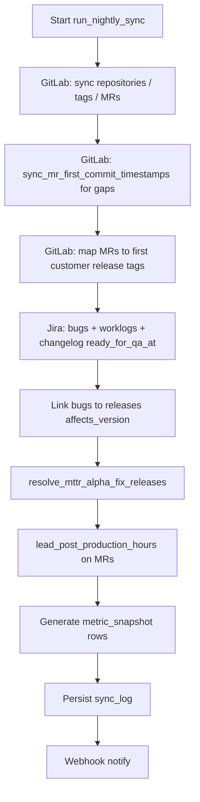

# DORA Metrics App — Overview

## Project Goal

Automated measurement and visualization of **DORA-style delivery metrics** for Plunet development: core DORA indicators plus agreed **extensions** (release wait, rework, MTTR Alpha). The dashboard is embedded in **Confluence** via iframe. Metric definitions are aligned with `**new_kpis.md`** in this folder.

---

## KPI Inventory

### Core metrics (canonical DORA set exposed first)


| Metric                             | Primary data sources       | Definition (short)                                                                                                                                                                                                                                                                                                                                                                                                                                                    |
| ---------------------------------- | -------------------------- | --------------------------------------------------------------------------------------------------------------------------------------------------------------------------------------------------------------------------------------------------------------------------------------------------------------------------------------------------------------------------------------------------------------------------------------------------------------------- |
| **Deployment Frequency**           | GitLab tags                | Count of `customer_release = true` tags per time period. RC/Beta excluded via configurable name patterns (`non_customer_release_markers`).                                                                                                                                                                                                                                                                                                                            |
| **Lead Time for Changes**          | GitLab MRs + tags          | From `**first_commit_at`** (earliest commit in MR, `GET /merge_requests/:iid/commits`) to `**committed_date**` of the first `customer_release` tag that contains `effective_commit_sha`. **Per `target_branch`:** `master` = feature stream; `9.x` / `10.x` / `11.x` = patch/maintenance stream. Dashboard: overall median/P75/P90 plus per-branch and feature-vs-patch views.                                                                                        |
| **Release Wait Time** (sub-metric) | GitLab MRs + tags          | `**merged_at`** → same first customer release tag. Surfaces batching, QA gating (master), patch cadence (maintenance branches).                                                                                                                                                                                                                                                                                                                                       |
| **Change Failure Rate**            | Jira + GitLab              | Among `customer_release` tags in the period: fraction with **≥1** linked `**healthy = true`** production bug (`affects_version` ↔ tag / version). Unhealthy bugs excluded from numerator logic. Binary per release (multiple bugs still = one failed release).                                                                                                                                                                                                        |
| **MTTR Alpha**                     | Jira + GitLab              | **DEV scope:** `bug.created_at` → `**first_fix_release_date`** (first customer release containing the fix). Eligible bugs: `**healthy = true**` and `**priority**` in configured set (default **Critical**, **Blocker**). Resolution: **(1)** MR with same `jira_key` → `first_customer_tag_date`; **(2)** fallback: `**fix_versions`** matched to tag names (with/without `v` prefix). Stored as `mttr_alpha_minutes` (+ path). Independent of Jira `**closed_at**`. |
| **Lead Post-Production**           | Jira Changelog + GitLab MR | `**ready_for_qa_at`** (first transition to a configured status, e.g. „Ready for QA“) → `**merged_at**` on the MR with matching `**jira_key**`. Surfaces queue/QA wait vs merge. **In scope for first implementation** (not deferred).                                                                                                                                                                                                                                 |
| **Jira worklog time**              | Jira REST worklog API      | All worklogs per issue stored in `**issue_worklog`**; `**total_worklog_seconds**` on `production_bug`. Compare **booked time** vs **calendar elapsed** (e.g. `merged_at − created_at` or `merged_at − ready_for_qa_at`) to highlight **work vs waited**.                                                                                                                                                                                                              |


### Extended / roadmap metrics


| Metric                     | Status        | Notes                                                                                        |
| -------------------------- | ------------- | -------------------------------------------------------------------------------------------- |
| **Rework Rate**            | Phase 1+      | Compare patch density per minor vs baseline minors (tag version parsing). Visualization TBD. |
| **MTTR Beta** (full cycle) | **Not in v1** | ServiceDesk incident → closure — see `new_kpis.md`.                                          |


### Recommended per-change fields (lead time exports)

For drill-downs and exports, each MR row should carry at minimum: `mr_id`, `target_branch`, `change_stream` (feature vs patch), `first_commit_at`, `merged_at`, `effective_commit_sha`, `release_tag`, `release_branch` / stream, `release_timestamp`, `lead_time_hours` (first commit → tag), `release_wait_time_hours` (merge → tag), derived **development/review** span (`first_commit_at` → `merged_at`), plus `**lead_post_production_hours`** when the linked Jira issue has `**ready_for_qa_at**`, and `**total_worklog_seconds**` (from Jira) for comparison.

---

## DORA metrics quick reference (implementation)


| Metric                | Data Source       | Calculation Logic                                                                           |
| --------------------- | ----------------- | ------------------------------------------------------------------------------------------- |
| Deployment Frequency  | GitLab tags       | Count `customer_release = true` per period                                                  |
| Lead Time for Changes | GitLab MRs + tags | `first_commit_at` → first matching `customer_release` tag; per branch/stream                |
| Release Wait Time     | GitLab MRs + tags | `merged_at` → first matching `customer_release` tag                                         |
| Change Failure Rate   | Jira + GitLab     | Failed releases / all `customer_release` tags in window                                     |
| MTTR Alpha            | Jira + GitLab     | `created_at` → `first_fix_release_date` for Critical/Blocker + healthy; two-path resolution |
| Lead Post-Production  | Jira + GitLab     | `ready_for_qa_at` → `merged_at` (MR linked by `jira_key`)                                   |
| Work vs elapsed       | Jira + GitLab     | `total_worklog_seconds` vs calendar intervals                                               |


---

## Daily data refresh workflow

**Objective:** Keep **raw entities** and **metric snapshots** in step with GitLab and Jira so the dashboard never reflects stale data older than one scheduled cycle (plus runtime duration), without manual dumps.

### Schedule


| Setting | Default                    | Configuration                                                          |
| ------- | -------------------------- | ---------------------------------------------------------------------- |
| Job     | `run_nightly_sync`         | APScheduler `CronTrigger`                                              |
| Time    | **02:00**                  | `sync_cron_hour`, `sync_cron_minute` in settings / `configuration.yml` |
| Process | Same OS process as FastAPI | Started/stopped in app `lifespan`                                      |


### Ordered steps (must stay consistent)




1. **GitLab collector** — Upsert repos, releases/tags, merged MRs for configured `target_branches`, compute `customer_release`, `effective_commit_sha`, Jira key from title/branch.
2. `**sync_mr_first_commit_timestamps`** — For MRs missing `first_commit_at`, call merge-request commits API; store minimum `committed_date`.
3. **Lead / release-wait mapping** — Commit refs API (tags); earliest `customer_release` tag with `committed_date >= merged_at`; fill `lead_time_hours`, `release_wait_time_hours`, match status.
4. **Jira collector** — Upsert bugs with `priority`, versions, health, indicators; **worklogs** → `issue_worklog` + `total_worklog_seconds`; **changelog** → `ready_for_qa_at` (status names from config).
5. `**map_bugs_to_releases`** — Association table for CFR (and integrity views).
6. `**resolve_mttr_alpha_fix_releases**` — Requires both GitLab and Jira data; writes `first_fix_release_*`, `mttr_alpha_minutes`, `mttr_alpha_resolution_path`.
7. `**lead_post_production_hours**` — On each MR with `jira_key`, join bug `ready_for_qa_at`; set `merged_at − ready_for_qa_at` when both exist.
8. `**generate_snapshots**` — Recompute snapshots for week/month/quarter as defined in `snapshot_service` (current period + completed periods).
9. `**sync_log**` + optional **webhook**.

### Failure and partial success

- GitLab and Jira collectors run in **isolated** try/except blocks; one failure does not abort the other.  
- **Snapshots** run if **at least one** collector succeeded (exact policy in `backend-components-documentation.md`).  
- **MTTR Alpha** resolution should run only when prerequisites exist (e.g. skip or no-op if GitLab sync failed entirely).  
- Operators rely on `**GET /sync/status`** (last run, per-collector status) and dashboard **SyncStatus** component.

### Idempotency and “evergreen” data

- Raw rows are keyed by stable identifiers (`gitlab_mr_id`, `jira_key`, `release.tag_name` + repo).  
- Nightly runs **upsert**; recent MRs/tags get new fields (e.g. first tag appears later → lead time updates on next run).  
- Snapshots for the **current** rolling period are **overwritten** each successful night so aggregates always match the latest raw data.

### User-visible freshness

- API responses include `**generated_at`** (snapshot timestamp).  
- **Sync status** shows last successful sync start/finish.  
- No continuous polling required: nightly refresh is sufficient for management reporting; optional Phase 2 “Refresh now” button may trigger the same pipeline ad hoc.

---

## Access control & administration (RBAC)

### Roles


| Role                 | Authentication       | Permissions                                                                                                                                                       |
| -------------------- | -------------------- | ----------------------------------------------------------------------------------------------------------------------------------------------------------------- |
| **Viewer** (default) | **None**             | **Read-only** access to dashboard, metrics API, sync status, data health views, Confluence embed.                                                                 |
| **Admin**            | **Required** (login) | Everything viewers can do, **plus** access to `**/admin/config`** (and corresponding **protected API routes**) to view and edit integration settings and secrets. |


### Principles

- **Public-by-default for read paths:** `GET /api/metrics/*`, `GET /api/repositories`, `GET /api/sync/status`, `GET /api/health` remain **unauthenticated** so Confluence iframe users and internal stakeholders need no accounts.
- **Config is never public:** Any route that reads or writes GitLab/Jira URLs, tokens, usernames, or `configuration.yml`-equivalent data requires **Admin** authentication.
- **Separation:** Admin UI is a **separate route** (`/admin/config`); link may be omitted from the main dashboard header for viewers or shown only when an admin session exists.

### Admin configuration surface

Admins configure the same logical content as `**configuration.yml`** and **environment variables** today, via a **form-based UI** backed by the API:


| Area                 | Examples (non-exhaustive)                                                                                                                                                                       |
| -------------------- | ----------------------------------------------------------------------------------------------------------------------------------------------------------------------------------------------- |
| **GitLab**           | Base URL, **Personal Access Token** (PAT), monitored `**gitlab_project_paths`**, `**target_branches**`, lookback, `non_customer_release_markers`.                                               |
| **Jira / Atlassian** | Jira base URL, **API user/email**, **API token**, `**excluded_projects`**, `**production_bug_indicator_cf_ids**`, `**ready_for_qa_status_names**` (exakte Statusnamen für Changelog), lookback. |
| **Scheduler / ops**  | Sync cron (hour/minute), webhook URL (optional), retention.                                                                                                                                     |


**Persistence:** Runtime values are stored in the **database** (structured settings + **encrypted at rest** for tokens/passwords); the process still reads `**configuration.yml` / `.env` on startup** as **bootstrap defaults** when DB is empty. **Secrets are never returned in full** from the API (masked, e.g. `****last4`). Changing config may require **reloading collector settings** or **restarting** the backend container — document the chosen behavior in implementation (hot-reload vs restart).

**Security:** Admin login uses a **session cookie** (HTTP-only, Secure, SameSite) or **short-lived JWT**; see `**api-specification-documentation.md`**. Initial admin bootstrap (first install) via env vars (`DORA_ADMIN_PASSWORD` / bootstrap token) is acceptable.

---

## Visualization & dashboard scope

**Implemented in Phase 1 (minimum):**

- Four **metric cards** (Deployment Frequency, Lead Time, CFR, MTTR Alpha) with trend vs previous period.
- **History trend chart** (time series) with period selector (week / month / quarter).
- **Metric detail modal** with explanation copy + sparkline/history from `GET /metrics/history`.
- **Sync status** + `**generated_at`** freshness indicators.
- **Datengrundlage Erstimplementierung:** `**lead_post_production_hours`**, `**issue_worklog**` / `**total_worklog_seconds**` — mindestens in **API/Export** und optional schlanke **Tabelle** (MR-Key, gebuchte Zeit vs. Kalender-/Wartezeit); volle **Chart-UX** kann Phase 1.5 folgen.

**Still to design / implement (explicit backlog):**


| Visual / view                   | KPI / data                                                                       | Notes                                                       |
| ------------------------------- | -------------------------------------------------------------------------------- | ----------------------------------------------------------- |
| **Lead time breakdown**         | Dev/review (`first_commit_at` → `merged_at`) vs release wait (`merged_at` → tag) | Stacked bar or two-series chart per period.                 |
| **Work vs waited (rich chart)** | `total_worklog_seconds` vs `merged_at − ready_for_qa_at` oder vs Kalender        | Erst **Phase 1.5** wenn P1 nur Tabelle/Export liefert.      |
| **Lead time by branch**         | `master` vs `9.x` / `10.x` / `11.x`                                              | Box plot, faceted bars, or small multiples (`new_kpis.md`). |
| **Feature vs patch stream**     | Derived from `target_branch`                                                     | Toggle or side-by-side panels.                              |
| **Release wait time**           | Dedicated card or sub-chart                                                      | Emphasizes QA/cadence vs hotfix responsiveness.             |
| **CFR drill-down**              | Which releases failed, linked bugs                                               | Table + link to Jira/GitLab.                                |
| **MTTR Alpha distribution**     | Histogram or percentile strip                                                    | Critical/Blocker subset.                                    |
| **Rework rate**                 | Patches per minor vs baseline                                                    | Bar/ratio chart; **definition in** `new_kpis.md`.           |
| **Data health dashboard**       | Unhealthy Jira %, unmatched MRs, version mismatches                              | Dedicated page or expandable panel.                         |
| **Confluence embed polish**     | Fixed height, no double scroll                                                   | `postMessage` resize optional.                              |


Recharts (or agreed library) is the default; accessibility (contrast, tooltips) should match internal design guidelines.

---

## Constraints

### Source systems

- GitLab self-hosted — `https://gitlab.plunet.com`
- Jira Cloud — `https://plunet.atlassian.net`
- Confluence Cloud — iframe to internal dashboard URL

### Branching model

- `**master`**: integration target for upcoming major/minor work.  
- `**9.x`, `10.x`, `11.x**`: protected maintenance lines; patches and hotfixes merge here; **customer tags** are typically on these lines.  
- Release-prep branches (e.g. `10.24.3-release`) merge into the maintenance branch; tag points at that line’s commit.  
- **Target branches for MR collection** — `master`, `9.x`, `10.x`, `11.x` (configurable in `configuration.yml`).

Collecting all listed target branches is **required** so patch lead times are not dropped (tags often do not land on `master`).

### Jira key on MRs

GitLab Free tier lacks native Jira linking. `**jira_key`** is parsed from MR **title**, then **source_branch**, then **description** (`\b([A-Z][A-Z0-9]+-\d+)\b`). Coverage ~66% of all MRs in POC; structural merges dominate the gap; real dev MRs have much higher coverage.

Use cases: CFR enrichment, traceability, **MTTR Alpha path 1**.

### Customer release definition

Tags are customer releases when the name does **not** match configured pre-release markers (default: `rc`, `beta`).

### Production bug definition

Issues: `issuetype in ("Bug", "Bug Subtask")`, lookback window, optional project exclusions. **Health** rules: see `jira-production-bug-filter-decision.md`. Only `**healthy = true`** issues participate in CFR and MTTR Alpha eligibility (plus priority filter for Alpha).

### RC / pre-release handling


| Metric                   | Pre-release tags                                   |
| ------------------------ | -------------------------------------------------- |
| Deployment Frequency     | Excluded                                           |
| Lead Time / Release Wait | Not used as first customer tag                     |
| CFR                      | Excluded from denominator as non-customer releases |
| MTTR Alpha               | Fix must be a **customer_release** tag             |


---

## Technology stack


| Component               | Technology                                        |
| ----------------------- | ------------------------------------------------- |
| Backend API + collector | Python 3.12 · FastAPI                             |
| Scheduling              | APScheduler (`AsyncIOScheduler`)                  |
| HTTP                    | httpx + Tenacity                                  |
| ORM                     | SQLAlchemy 2.x **sync** · psycopg2                |
| Migrations              | Alembic                                           |
| Config                  | pydantic-settings · `.env` · `configuration.yml`  |
| DB                      | PostgreSQL 16                                     |
| Frontend                | Next.js 14 · TanStack Query · Recharts · Tailwind |


---

## Repository layout

```
dora-metrics-server/
├── backend/
│   ├── app/
│   │   ├── main.py
│   │   ├── config.py
│   │   ├── database.py
│   │   ├── models/
│   │   ├── schemas/
│   │   ├── api/
│   │   ├── collectors/       # gitlab_collector, jira_collector
│   │   ├── services/
│   │   └── scheduler.py
│   ├── alembic/
│   └── tests/
├── frontend/
├── configuration.yml
├── docker-compose.yml
└── .env.example
```

---

## Architecture

```
GitLab API          Jira API
    │                  │
    └────────┬─────────┘
             ▼
    ┌─────────────────────┐
    │ FastAPI + APScheduler│  ← nightly: collect → link → snapshots
    └─────────┬───────────┘
              ▼
         PostgreSQL
              ▼
         FastAPI REST
              ▼
      Next.js (Confluence iframe)
```

Collector and API share one **Python process** (no separate worker container required for MVP).

---

## Operations


| Aspect            | Detail                                                                                              |
| ----------------- | --------------------------------------------------------------------------------------------------- |
| Hosting           | On-premise Docker Compose                                                                           |
| TLS / proxy       | Caddy on host                                                                                       |
| **Data refresh**  | **Daily** scheduled sync (default 02:00); see **Daily data refresh workflow**                       |
| Historical window | Configurable lookback (e.g. 2 years)                                                                |
| **Access**        | Internal network; **viewers unauthenticated**; **admins** authenticate for `**/admin/config`** only |
| **Configuration** | Bootstrap: `configuration.yml` + `.env`; **runtime:** Admin UI → DB (encrypted secrets)             |
| Git scope         | `gitlab_project_paths` (configurable via Admin UI)                                                  |
| Jira scope        | Bugs in window minus `excluded_projects`                                                            |
| Ports             | Backend `8000`, frontend `3000`                                                                     |
| Secrets           | `.env` + **DB-encrypted** copies when set via Admin UI                                              |
| Backup            | `pg_dump` + retention in config                                                                     |
| Alerts            | Webhook on sync failure (configurable)                                                              |


---

## Data quality

Dashboard **Data Health** view:

- Jira: `healthy` / `healthmemo` breakdown; missing affects/fix versions; MTTR Alpha **unresolved** Critical+ count.  
- GitLab: MRs without matching customer tag; version mismatches Jira ↔ tags.

POC baseline (example, 2026-03): ~98.7% MR lead-time match rate; ~two-thirds Jira issues `healthy=true` — see historical `open-questions.md` / POC exports.

---

## MVP roadmap


| Phase         | Scope                                                                                                                                                                                                                         |
| ------------- | ----------------------------------------------------------------------------------------------------------------------------------------------------------------------------------------------------------------------------- |
| **Phase 1**   | Core metrics in DB/API; **Lead Post-Production** + **Jira worklogs** (DB + KPI); **basic visuals** (cards + history chart); data health (minimal); **daily sync**; Confluence embed; **RBAC** (anonymous read + Admin config) |
| **Phase 1.5** | **Extended visuals** (lead time breakdown, by-branch, **work vs waited** charts, CFR/MTTR drill-downs, rework) per **Visualization & dashboard scope**                                                                        |
| Phase 2       | Per-repository filters; optional manual “sync now”; CORS locked to known origins + **credential support for admin cookie**                                                                                                    |
| Phase 3       | Team/product dimensions; optional SSO for Admin                                                                                                                                                                               |


